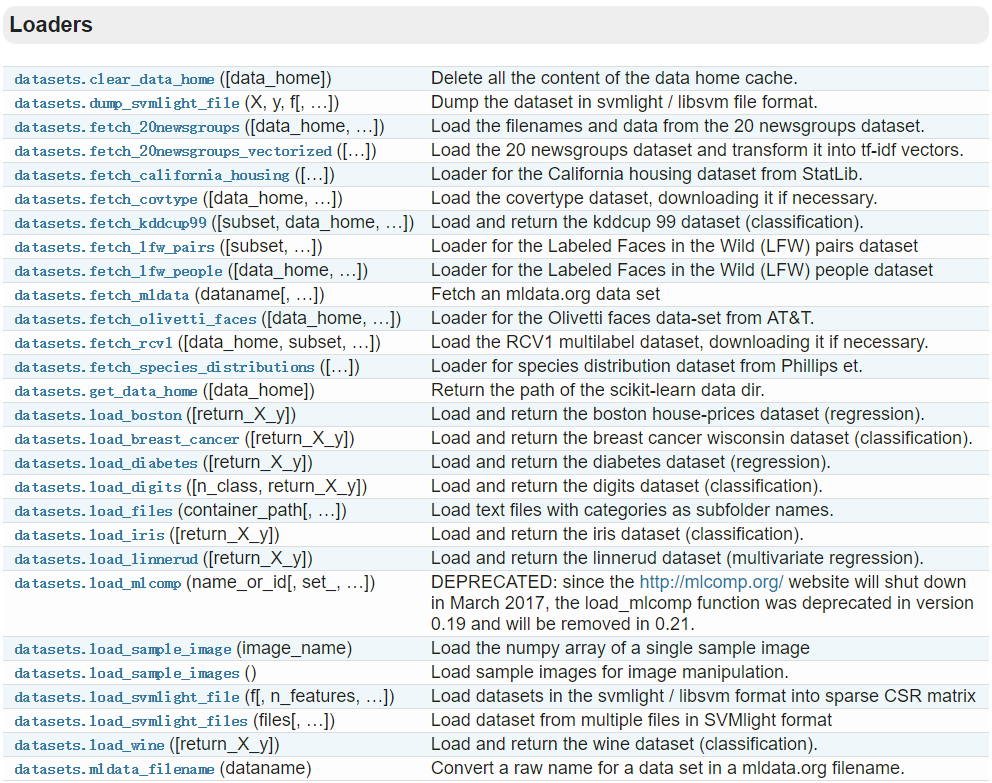
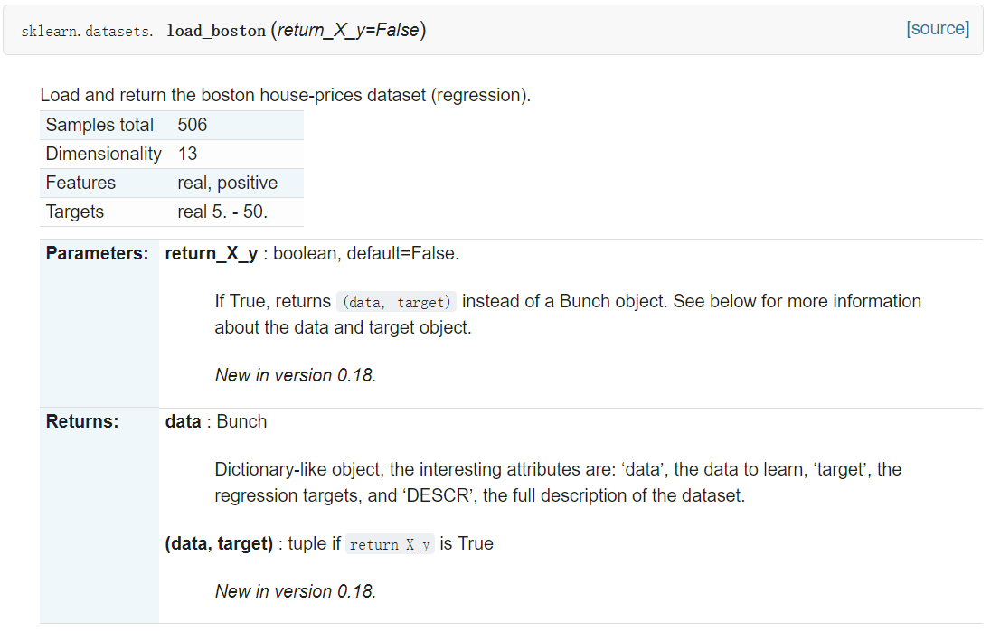
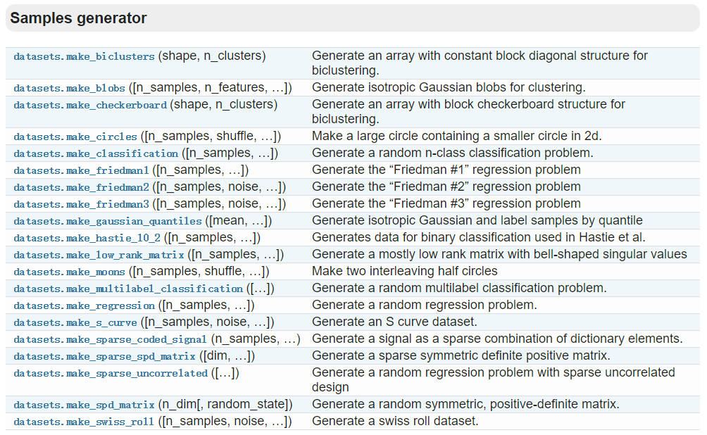

# Scikit-learn 机器学习

[TOC]


算法分为五类：

**监 督 学 习**：给定标签和数据

**非监督学习**，只提供数据不提供标签，让其自行分类。

**半监督学习**：通过少量有标签的样本和大量没有标签的样本进行训练和分类

**强 化 学 习**：从经验中总结和提升

**遗 传 算 法**：适者生存，不适者淘汰


## scikit-learn 安装

scikit-learn 安装需要满足以下条件：

- Python( >=2.6 或 >=3.3)
- Numpy (>=1.6.1)
- Scipy     (>=0.9)

如果条件都满足，可以直接用以下命令安装：

```python
pip install scikit-learn
```


## 如何选择机器学习方法

scikit-learn包括哪些内容：


从 START开始，首先看数据的样本是否 <50，小于则需要收集更多数据

由上图，可以看到算法分为了四类：**分类、回归、聚类、降维**

其中，**分类**和**回归**是监督学习，即每个数据对应一个label。**聚类**是非监督学习，即没有label。另外一类是**降维**，当数据由很多很多属性时，可以通过降维算法把属性归纳起来。例如20个属性改变为2个，注意，这不是挑出2个，而是压缩称为2个，它们集合了20个属性的所有特征，相当于把重要的信息提取的更好，不重要的信息就不要了。

然后看问题属于哪一类，是分类还是回归，还是聚类。然后选择相应的算法。当然还要根据数据量的大小。


## 通用学习模式

Sklearn 把所有的机器学习模式整合统一起来了，学会了一个模式就可以通吃其它不同类型的学习模式：

例如，分类器：

Sklearn本身就有很多数据库，可以用来学习。以iris的数据为例，这种花由四个属性，花瓣的长宽，茎的长宽，根据这些属性把花分为三类。


今天用**KNN classifier**，就是选择几个临近点，综合它们做个平均来作为预测值。

```python
import numpy as np
# 导入模块
from sklearn import datasets
from sklearn.cross_validation import train_test_split
from sklearn.cross_validation import train_test_split
from sklearn.neighbors import KNeighborsClassifier

#创建数据，加载iris的数据，把属性存在iris_X,类的标签存在iris_y
iris_X, iris_y = datasets.load_iris(return_X_y=True)

#print(iris_X[:2, :])
#print(iris_y)

#把数据集分为训练集和测试集，其中 test_size=0.3，即测试集占总数据集的30%
X_train, X_test, y_train, y_test = train_test_split(iris_X, iris_y, test_size=0.3)

#print(y_train)

#建立模型——训练——预测
#定义模型为 KNeighborsClassifier()
knn = KNeighborsClassifier()
#用fit来训练training data，下面这一步就完成了训练的所有步骤，经过这一步后，knn就为训练好的模型
knn.fit(X_train, y_train)

#现在可以直接使用predict来预测测试集的数据
print(knn.predict(X_test))
print(y_test)
```


## sklearn 的 datasets

datasets以下链接中查看：

[datasets]: http://scikit-learn.org/stable/modules/classes.html#module-sklearn.datasets

sklearn的datasets中，可以直接导入数据，如：




点击进入datasets.load_boston()，可看到sample总数，属性以及label等信息：



datasets除了导入原有数据外，也可以生成虚拟数据：



生产虚拟数据时，只需按照函数的格式，输入sample、feature、target等即可。

练习：

```python
from sklearn import datasets                             #导入数据
from sklearn.linear_model import LinearRegression        #导入模型

data_X, data_y = datasets.load_boston(return_X_y=True)   #导入数据

model = LinearRegression()                               #指定使用模型
model.fit(data_X, data_y)                                #利用数据进行训练

print(model.predict(data_X[:4]))                         #输出预测结果
print(data_y[:4])
```

机器学习中，通常需要尝试不同的model，尝试完不同的model后还要尝试不同的参数，尝试完参数后还要尝试不同的数据处理形式，比如：normalization等。入门的话，可直接使用默认值。


## sklearn中model的常用属性和功能

```python
from sklearn import datasets
from sklearn.linear_model import LinearRegression

data_X, data_y = datasets.load_boston(return_X_y=True)

model = LinearRegression()
model.fit(data_X, data_y) #训练模型

print(model.predict(data_X[:4]))#利用训练好的模型进行预测
print(model.coef_)      #若线性函数为 y=0.1x+0.3，则mode.coef_输出0.1位置的参数-斜率
print(model.intercept_) #若模型为上述线性函数，则mode.intercept__输出0.3位置的参数-截距

print(model.get_params()) #输出之前定义的参数
print(model.score(data_X, data_y)) #利用R^2 coefficient of determination
                                   #关于R^2 coefficient of determination可查看wiki

```


## 正则化 nomalization

